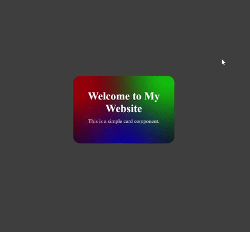

# Cool Card CSS Template

A simple and customizable CSS card template with animated gradient blur effects and smooth hover interactions.

## ✨ Features

* Animated gradient blur background
* Smooth hover animation
* Responsive and customizable
* Easy to modify
* Pure HTML and CSS

## 🚀 Preview

A colorful animated card with blur effects that reacts when you hover over it.

## 🛠️ Customization

You can easily customize:

* Card size
* Border radius
* Gradient colors
* Blur intensity
* Hover animation
* Text content

## 📁 Project Structure

```text
cool-card-css/
│
├── LICENSE
├── README.md
├── index.html
└── style.css
```
## 🎬 Preview



## 💻 Usage

Clone or download this repository and open `index.html` in your browser.

Feel free to modify the template and use it in your own projects.

## 👨‍💻 Author

 Arjuna Naufal
